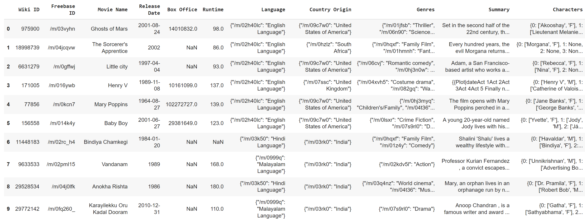

# MovieGenderBias
Final project for CS1699: AI for Good: Ethics and Implications

Jared Belsky and Ryan Bennett 

## Description and Goals
For this project, we plan to analyze gender bias in movie plot summaries over time. This is important because many AI models are trained on large text datasets such as a movie corpus. Identifying and exploring these potential biases is an important ethical consideration. We plan to explore the corpus and run basic NLP analyses on the movie summaries to determine gender bias, ranking movies for bias over time. 

## Datsets used
For this project we utilized the CMU movie corpus: [http://www.cs.cmu.edu/~ark/personas/](http://www.cs.cmu.edu/~ark/personas/)

The corpus consisted of three main files we used
1. The character metadata `character.metadata.tsv`
2. The movie metadata `movie.metadata.tsv`
3. The movie summaries `plot_summaries.txt`

## Process

First, we install necessary packages including, spacy and pandas.

Next we import all three datasets, and go through cleaning the data. First we must get each dataset ready to be merged into one dataframce. To do this we needed to clean up the null characters in the charcter dataset, and then collect all of the characters into a single list that is associated with associated with a movie wikipedia ID. The same process is used for the movie summaries, associating each one with it's associated wikipedia ID. We then merge all of this data into one dataframe displayed below.

Now we use spacy and NLP processes to calculate a bias score for each movie. To do this, we simply find every subject/verb or subject/adjective pair in the summary and assign a gender to both. To assign a gender to the subject, we use the character list or pronouns to identify the gender. To assign a gender to the verb/adjective, we use word vectors to test its similarity to a set of stereotype words for each gender. If it is similar enough to any of these words, it is assigned the associated gender. Then, for every pair we come across, we increment a total counter, and increment a bias counter every time the subject gender matches the verb/adjective gender (This indicates stereotype is being reinforced). Then we simply divide the bias count by the total count to give the movie a final bias score between 0 and 1.

Here are the graphs that represent bias over time.

There was a very small sample size before 1920, so the bias scores were unreliable. Because of this, we omitted all years before 1920. As we can see, there was a very slight increase in bias score over time. However, there are a number of limitations that make these results unreliable (as detailed in the full report). Nevertheless, it is interesting to see the results that our methods produced.
